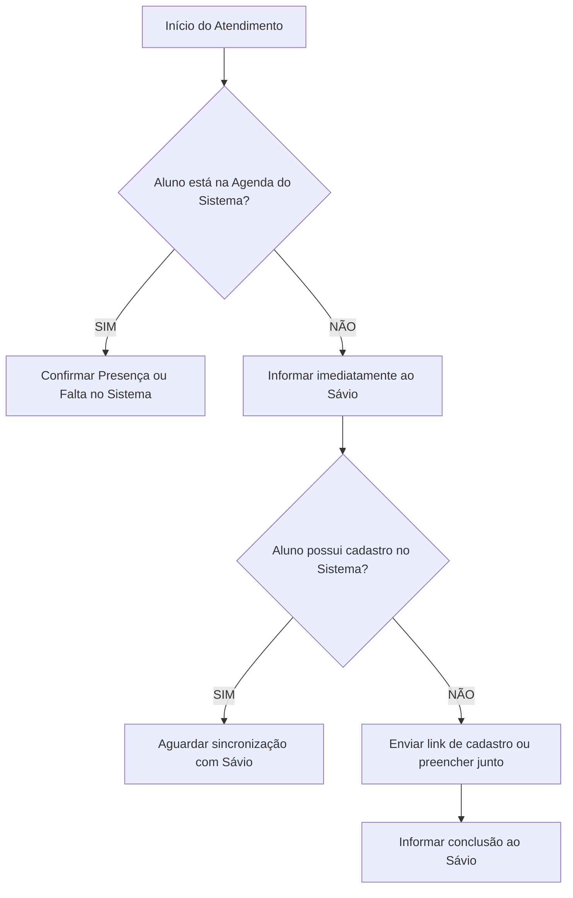

# 🚀 Guia Prático do Profissional — Fase 1: Transição e Agenda

> **💡 Dica de Ouro para a Equipe:**  
> Não faça desse processo algo penoso! A partir de agora, cada falha faz parte da solução que estamos construindo. Com empenho, vamos conseguir consolidar 100% dos nossos clientes no sistema! 💪

---

## 🎯 1. Fluxo de Atendimento e Agenda (Transição com o Admin Fit)

Nesta 1ª etapa, o nosso sistema é a **referência oficial da equipe** para consulta de horários e confirmação de presença.

### 📋 Regras de Ouro:
1. **Confirmar Presença / Falta:** Todos os atendimentos devem ter seu status atualizado na agenda do nosso sistema.
2. **Aluno agendado no Admin Fit que não apareceu no sistema:** Apenas informe ao **Sávio**.
3. **Aluno sem cadastro no sistema:** 
   - 🔍 **Cuidado com Duplicações:** Antes de enviar link, pesquise o nome na barra de busca superior do sistema (é super fácil e rápido).
   - Se realmente não existir, envie o link de cadastro ou preencha com o aluno e avise o **Sávio** em seguida.
4. **Agendamento Manual pelo Profissional:**
   - Como os alunos ainda usam o **Admin Fit**, antes de agendar qualquer aluno pelo nosso sistema:
     1. Abra o **Admin Fit** e **feche a vaga** lá.
     2. Em seguida, acesse **"Agendar Aluno"** no nosso sistema e realize o agendamento.

---

## 🖥️ 2. Guia de Uso Rápido das Ferramentas do Profissional

---

### 📅 1. Menu "Resumo do Dia" & Confirmação de Presença
O **Resumo do Dia** é o painel principal de trabalho diário do profissional:

1. **⭐ Atendimentos no Horário Atual (Janela Ativa):**
   - Mostra em destaque os alunos que estão no horário de atendimento **agora**.
   - **🟢 Presença:** Abre o rápido **Questionário Wellness do Dia** (3 perguntas: Sono, Fadiga e Dor de 1 a 10). O sistema calcula o score na hora (ex: *Treino de Alta Carga Liberado* ou *Alerta de Recuperação*), registra a presença e computa a frequência.
   - **🔴 Falta / Cancelar:** Registra a ausência do aluno para histórico e controle de frequência.
   - **📋 Abrir Ficha de Treino:** Botão de atalho direto para visualizar e executar a ficha de treino do aluno naquele horário sem precisar buscá-lo manualmente.

2. **🗓️ Todos os Atendimentos de Hoje:**
   - Visualização em lista de toda a grade do dia dividida por horários (ex: 06:00, 07:00, 11:00...).
   - Acompanhamento em tempo real de quem já treinou (Presença), quem faltou (Falta) e quem ainda está como Agendado.

---

### 📆 2. Menu "Agenda Completa" & "Agendar Aluno"
- **Agenda Completa:** Visão geral semanal e mensal de todos os profissionais e horários da academia/consultório.
- **Agendar Aluno:** Permite agendar ou remanejar horários de clientes (*lembre-se: fechar a vaga no Admin Fit antes de agendar por aqui*).

---

### 🩺 3. Realizar e Consultar Avaliações
1. No menu do profissional, acesse a aba **"Avaliações"**:
   - **Avaliação Fisioterápica / Relatório:** Clique em **"Nova Avaliação Fisioterápica"** ➔ Preencha a anamnese, goniometria e testes especiais ➔ Clique em **Salvar** ➔ O PDF com os alertas clínicos e assinatura do responsável técnico sai automaticamente.
   - **Avaliação Física / Cinesiológica:** Clique em **"Nova Avaliação Física"** ➔ Registre circunferências, composição e conduta ➔ Salve e gere o PDF com gráficos de evolução.

---

### 📊 4. Teste de Força Muscular (Dinamometria)
1. No menu do profissional, acesse a aba **"Teste de Força"**.
2. Clique em **"Novo Teste de Força"**, selecione o aluno e as articulações avaliadas.
3. Preencha as cargas obtidas em Newtons ($N$) ou $kgf$:
   - O sistema calcula na hora a simetria lateral, as razões agonista/antagonista e os alertas inteligentes (**ICAI**, **CORE COMPLEX** e **ISE**).
4. Clique em **"Gerar Laudo PDF"** para obter o documento quantitativo completo de 2 páginas.

---

### 📝 5. Prontuários e Evolução Diária
1. No menu do profissional, acesse a aba **"Prontuários"** (ou **"Dados Clínicos"**):
   - Clique em **"Nova Evolução / Anotação"** e selecione o aluno.
   - Escreva a conduta realizada na sessão ou observações clínicas relevantes.
   - Salve.
   - Se necessário, clique em **"Exportar Prontuário em PDF"**.

---

### 🏋️‍♂️ 6. Fichas de Treino
1. No menu do profissional, acesse a aba **"Fichas de Treino"**.
2. Clique em **"Criar / Editar Treino"**.
3. Selecione os exercícios na biblioteca integrada.
4. Salve para disponibilizar na tela de execução do treino monitorado.
