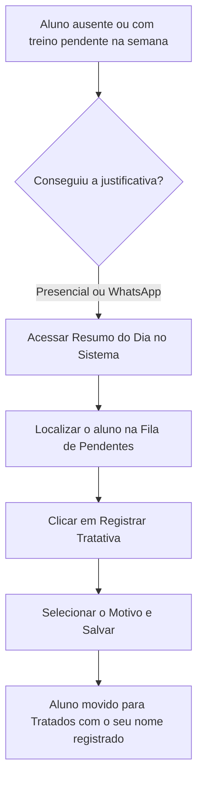

# 🚀 Guia Prático do Profissional — Fase 2: Registro de Justificativas de Ausência

> **💡 Dica de Ouro para a Equipe:**  
> A partir de agora vamos registrar o motivo da ausência de um aluno pelo sistema. Pela rotina e contato frequente com os clientes é possível nos organizarmos. Ao transparecer para os clientes que essa informação é necessária, teremos um controle muito melhor da agenda! 💪

---

## 🎯 1. Já Conseguiu a Justificativa da Ausência? Insira no Sistema!

Seja em conversa presencial no salão ou através de contato pelo WhatsApp:

---

## 📝 2. Como Lançar uma Tratativa (Passo a Passo)

1. No menu do profissional, acesse **"Resumo do Dia"**.
2. Na seção **Central de Retenção & Fila de Tratativas**, localize o aluno na aba **"Pendentes de Tratativa"**.
3. Clique no botão **`📝 Registrar Tratativa`** ao lado do nome do aluno.
4. Selecione o motivo correspondente à justificativa obtida:
   - 📅 **Agendou reposição de treino** *(o aluno já combinou outro dia/horário)*
   - ✈️ **Em viagem / Férias justificadas** *(está fora da cidade/em recesso)*
   - 🩺 **Atestado médico / Afastamento clínico** *(questão de saúde, dor ou repouso)*
   - 🔄 **Reagendará na próxima semana** *(vai compensar no próximo ciclo)*
   - 📭 **Sem resposta no WhatsApp / Contatado** *(tentou contato e aguarda retorno)*
   - ✍️ **Outro motivo** *(com campo para anotações clínicas rápidas)*
5. (Opcional) Digite uma observação rápida caso queira registrar detalhes adicionais *(ex: "Aluno viajou a trabalho e retorna segunda-feira")*.
6. Clique em **`Salvar Tratativa`**.

> **✅ Pronto!** O aluno é transferido imediatamente para a aba de **Tratados nesta Semana**, ficando registrado o seu nome como responsável, a data e a hora da tratativa.

---

## 🌟 3. Checklist Diário da Equipe:
- [ ] Ao notar ausência ou treino pendente, obter a justificativa com o aluno.
- [ ] Clicar em **`Registrar Tratativa`** e salvar o motivo no sistema.
- [ ] Manter a fila de pendentes zerada ao final de cada dia.
