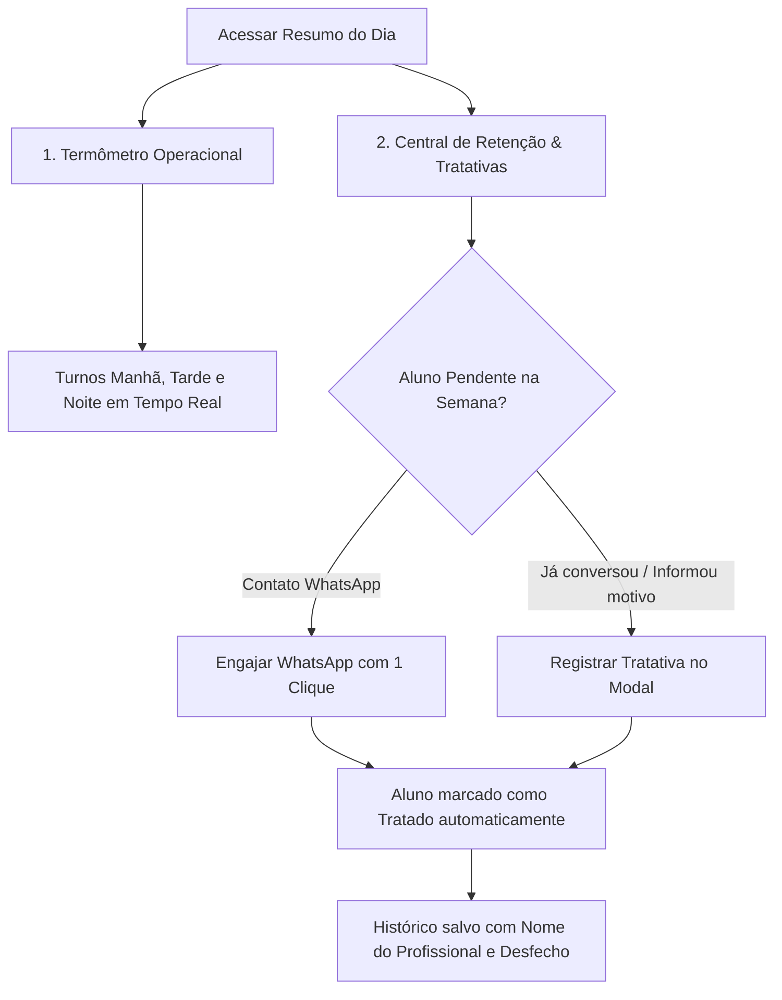

# 🚀 Guia Prático do Profissional — Fase 2: Gestão de Presença & Fila de Tratativas

> **💡 Filosofia do Cuidado & Organização da Equipe:**  
> O contato frequente e acolhedor com nossos alunos é o coração do Clube Fitness. Pelo celular da clínica, ao notar uma ausência ou risco de perda da meta semanal, o fisioterapeuta entra em contato.  
> Quando deixamos transparente para o aluno que essa informação é necessária para organizarmos os horários e garantirmos a melhor atenção individualizada, transformamos a rotina em uma experiência de alto padrão e acolhimento! 💪

---

## 🎯 1. O Que É o Cockpit & Central de Retenção?

Ao acessar o menu **"Resumo do Dia"** no painel do profissional, você encontra duas ferramentas essenciais:

---

## 📊 2. Conhecendo a Tela

### 🕒 1. Termômetro Operacional da Clínica (Hoje)
- **Turno Manhã (06h - 12h)** • **Turno Tarde (12h - 18h)** • **Turno Noite (18h - 22h)**
- Exibe a quantidade de atendimentos e os nomes dos alunos organizados em **ordem crescente por horário**.
- Permite que a equipe veja a densidade do salão e o fluxo de alunos antes de cada janela de treino.

---

### 🛡️ 2. Central de Retenção & Fila de Tratativas (Anti-Churn)
Monitora automaticamente a meta semanal contratada de cada aluno (*ex: 2x/sem, 3x/sem, 5x/sem*):

1. **🔴 Aba "Pendentes de Tratativa":**
   - Lista os alunos que ainda não cumpriram a meta da semana e possuem poucos dias úteis restantes para treinar.
   - **Exemplo:** Aluno contratou 3x/semana, fez 1 treino, não agendou os outros 2 e restam apenas 2 dias úteis.

2. **🟢 Aba "Tratados nesta Semana":**
   - Registra todos os alunos que já foram contatados ou que já tiveram seu motivo justificado.
   - Mostra **quem tratou** (*seu nome*), **data/hora** e o **motivo**.

3. **📋 Aba "Todos os Alunos com Meta":**
   - Visão completa com barra de progresso individual de treinos da semana.

---

## 📱 3. Como Lançar uma Tratativa (Passo a Passo)

Você tem duas formas simples e rápidas de registrar:

### 🟢 Opção A: Pelo WhatsApp (Mais Rápido — 1 Clique)
1. Na aba **"Pendentes de Tratativa"**, localize o aluno.
2. Clique no botão verde **`💬 Engajar WhatsApp`**.
3. O sistema abre o WhatsApp da clínica com uma mensagem personalizada e acolhedora:
   > *"Olá [Nome]! Aqui é do Clube Fitness Fisio. Notamos que você tem 1 treino pendente da sua meta semanal (3x/semana). Restam 2 dias úteis (quinta e sexta) para agendar. Vamos agendar seu próximo horário? 💪"*
4. **O sistema automaticamente move o aluno para "Tratados"**, gravando seu nome e o registro do contato!

---

### 📝 Opção B: Registro Manual de Desfecho (Quando o Aluno Já Justificou)
Se o aluno já conversou presencialmente com você no salão ou avisou o motivo da falta:

1. Ao lado do aluno, clique no botão cinza **`📝 Registrar Tratativa`**.
2. Uma janela se abrirá para selecionar o motivo:
   - 📅 **Agendou reposição de treino** *(o aluno já marcou outro dia)*
   - ✈️ **Em viagem / Férias justificadas** *(está fora da cidade)*
   - 🩺 **Atestado médico / Afastamento clínico** *(questão de saúde/repouso)*
   - 🔄 **Reagendará na próxima semana**
   - 📭 **Sem resposta no WhatsApp / Contatado**
   - ✍️ **Outro motivo**
3. (Opcional) Escreva uma nota curta no campo de observações:
   > *Ex: "Aluno informou que teve compromisso de trabalho e virá sexta às 17h."*
4. Clique em **`Salvar Tratativa`**.
5. Pronto! O aluno é movido imediatamente para a aba de **Tratados**.

---

## 💬 4. Dicas de Ouro para a Comunicação com o Aluno

1. **Acolhimento em Primeiro Lugar:**
   - O contato não é uma cobrança mecânica, mas sim um sinal de que a equipe se importa com a constância e os resultados dele.
2. **Explicar a Necessidade da Informação:**
   - *"Fulano, quando você nos avisa com antecedência sobre suas viagens ou ausências, conseguimos organizar melhor a grade dos fisioterapeutas e liberar vagas para reposições."*
3. **Reabertura Fácil:**
   - Se precisar desfazer uma tratativa, basta ir na aba **"Tratados nesta Semana"** e clicar em **`Reabrir`** para o aluno voltar aos pendentes.

---

## 🌟 Resumo das Responsabilidades Diárias:
- [ ] Checar o **Termômetro Operacional** ao iniciar o turno.
- [ ] Confirmar a **Presença (com Wellness)** ou **Falta** dos alunos do seu horário.
- [ ] Ao final do turno, abrir a **Fila de Tratativas** e zerar os pendentes do dia pelo celular da clínica.
