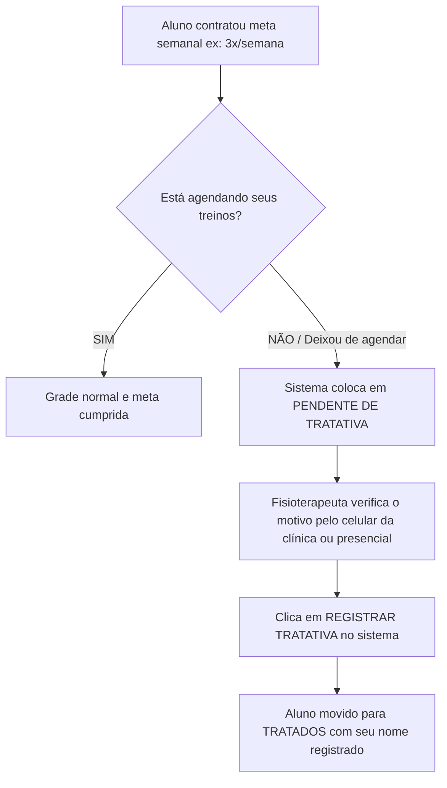

# 🚀 Guia Prático do Profissional — Fase 2: Monitoramento de Evasão & Alunos Sem Agendamento

> **💡 Dica de Ouro para a Equipe:**  
> O maior risco de desistência de um aluno não é a falta pontual, mas o **sumiço silencioso de quem deixa de agendar seus treinos**.  
> Quando você acompanha a frequência semanal e procura saber o motivo pelo qual o aluno não está agendando, ele se sente acolhido e nós garantimos a organização da clínica! 💪

---

## 🎯 1. O Que É o "Risco de Evasão" e Por Que Monitoramos?

Diferente de um aluno que faltou no dia de hoje, o **aluno em risco de evasão é aquele que não está agendando seus treinos contratados**:

### 🔍 Como o Sistema Identifica:
- O sistema compara: **Meta Contratada** (*ex: 3x/semana*) com os **Treinos Realizados + Agendados** e os **Dias Úteis Restantes**.
- Se faltam treinos e não há horários agendados suficientes até o fim da semana, o aluno entra na lista de **🔴 Pendentes de Tratativa**.

---

## 📝 2. Como o Profissional Lança a Tratativa no Sistema

Assim que você identificar o aluno pendente e souber o motivo pelo qual ele não agendou:

1. No menu do profissional, acesse **"Resumo do Dia"**.
2. Role até a **Central de Retenção & Fila de Tratativas** e localize o aluno na aba **"Pendentes de Tratativa"**.
3. Clique no botão **`📝 Registrar Tratativa`** ao lado do nome do aluno.
4. Selecione o motivo que explica a ausência de agendamento:
   - 📅 **Agendou reposição / novos horários** *(o aluno já marcou seus horários)*
   - ✈️ **Em viagem / Férias justificadas** *(motivo de não agendar nesta semana)*
   - 🩺 **Atestado médico / Afastamento clínico** *(questão de saúde, dor ou repouso)*
   - 🔄 **Reagendará na próxima semana** *(vai compensar no próximo ciclo)*
   - 📭 **Sem resposta no WhatsApp / Contatado** *(tentamos contato e aguardamos retorno)*
   - ✍️ **Outro motivo** *(com campo para anotações clínicas rápidas)*
5. (Opcional) Digite uma observação rápida caso queira registrar detalhes adicionais *(ex: "Aluno viajou a trabalho e retorna segunda-feira")*.
6. Clique em **`Salvar Tratativa`**.

> **✅ Pronto!** O aluno é transferido imediatamente para a aba de **Tratados nesta Semana**, registrando o seu nome como responsável, a data e a hora da tratativa.

---

## 🌟 3. O Impacto Disso para a Equipe e para o Aluno

1. **Zero Alunos Esquecidos:** Nenhum aluno passa uma semana inteira sem treinar sem que a equipe saiba a razão.
2. **Cuidado Clínico e Não Cobrança:** O aluno percebe que a equipe de fisioterapia está genuinamente atenta à constância e aos resultados dele.
3. **Controle Real da Agenda:** Sabendo com antecedência quem não comparecerá, podemos remanejar vagas e atender melhor todos os pacientes.

---

## ✅ Checklist Diário de Organização da Equipe:
- [ ] Checar a **Fila de Pendentes** na Central de Retenção.
- [ ] Ao notar que o aluno não está agendando, entender o motivo.
- [ ] Clicar em **`Registrar Tratativa`** e salvar a justificativa no sistema.
- [ ] Manter a lista de pendentes zerada ao final de cada semana.
